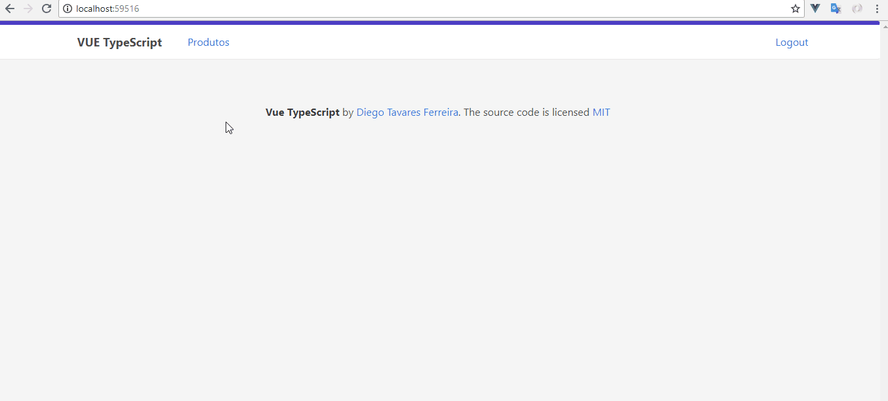
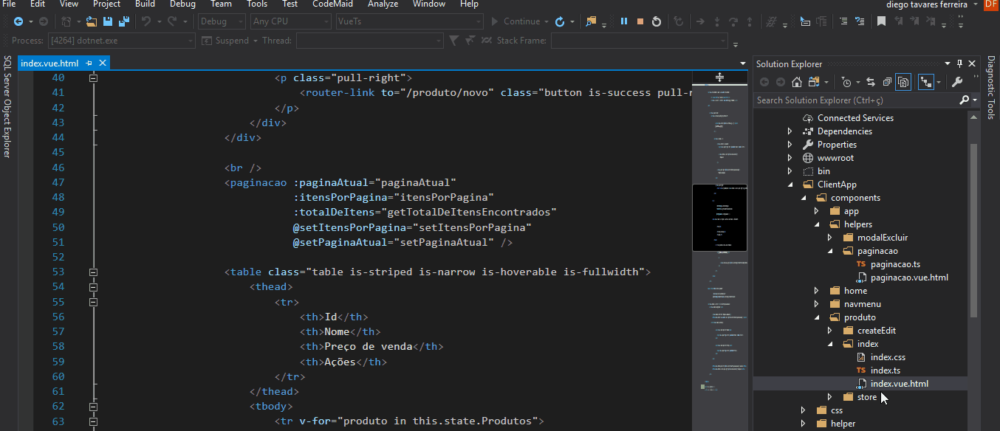
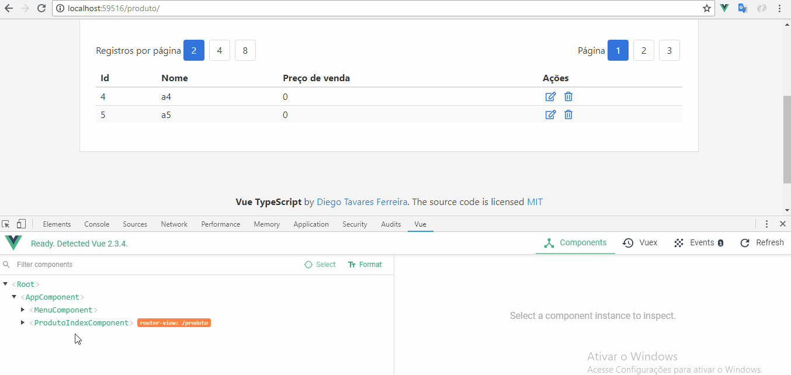

## What is this project?
CRUD example using VUE and VUEX with TypeScript, authentication using asp.net core identity and DDD architecture.

Vuex

Pagination 

Create and search

## Technologies:
- Vue
- Vuex
- Bulma
- ASP.NET Core 2
- ASP.NET Identity
- Entity Framework Core 2
- .NET Core DI
- AutoMapper
- FluentValidator
- Repository
- Unit of work

## Architecture:
- DDD (Domain Driven Design) 

## How to use:
- You will need .Net CORE SDK 2.1, NodeJs, SqlServer and Visual studio 2017
- With pront command, open the directory "src\0 - Presentation\VueTs" and run "npm install" 
- Run migration 1 (identity) "Update-Database -Project "Ddd.Infra.CrossCutting.Identity" -Context ApplicationDbContext" 
- Run migration 2 "Update-Database -Project "Ddd.Infra.Data" -Context ContextBase"
- [Vue dev tools for chrome] (https://chrome.google.com/webstore/detail/vuejs-devtools/nhdogjmejiglipccpnnnanhbledajbpd)

## Contact:
[Diego Tavares Ferreira](https://www.linkedin.com/in/diego-tavares-ferreira/)
